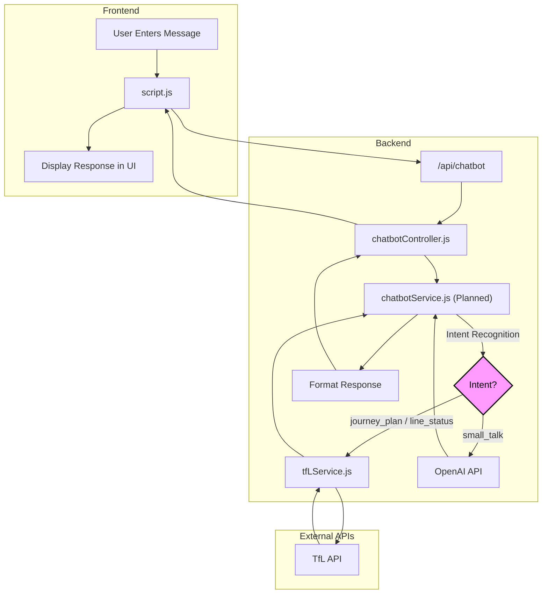

# Chatbot Development: Techniques and Approach

This document outlines the techniques and architectural approach used in the creation of the 'Tube Navigator' (Winston) chatbot.

## 1. Frontend Development

The frontend is responsible for the user interface and the user's interaction with the chatbot.

### UI/UX

* **Themed Interface:** The chatbot has a unique, tube-themed design to create a more engaging and memorable user experience. The UI is designed to resemble the front of a London Underground train, complete with a destination board, headlights, and the iconic roundel logo.
* **Pop-up Behavior:** The chatbot is implemented as a pop-up window that can be toggled by the user. This ensures that it doesn't clutter the main application interface and is only visible when needed.
* **Toggle Button:** A floating action button with a dynamic icon is used to toggle the chatbot's visibility. The icon intelligently switches between a "chat" icon and a "close" icon, providing a clear visual cue to the user.

### Interactivity

* **Asynchronous Communication:** The frontend uses asynchronous JavaScript (async/await with the Fetch API) to communicate with the backend without blocking the user interface.
* **Real-time Feedback:** When a user sends a message, the UI provides instant feedback by displaying their message and an animated "thinking" indicator while waiting for the bot's response.
* **DOM Manipulation:** The chat messages are dynamically created and appended to the chat window using JavaScript DOM manipulation.

## 2. Backend Development

The backend is responsible for the chatbot's logic and its integration with external services.

### Architecture

* *Separation of Concerns:** The backend follows a clear separation of concerns pattern:
* **Routes (`routes/index.js`):** Defines the `/api/chatbot` endpoint.
* **Controllers (`controllers/chatbotController.js`):** Handles the incoming HTTP requests, validates the input, and calls the appropriate service.
* **Services (future `services/chatbotService.js`):** This is where the core business logic of the chatbot will reside. It will be responsible for intent recognition, orchestrating calls to other services (like the TfL API and OpenAI), and formatting the final response.
* **Scalability:** This architecture is designed to be scalable and maintainable. As the chatbot's abilities grow, new logic can be added to the service layer without cluttering the controller.

### API Integration

* **OpenAI Integration:** The chatbot is connected to the OpenAI API to provide natural language understanding and generation. A system prompt is used to define the chatbot's persona ("Winston"), ensuring that its responses are consistent with the desired tone and character.
* **Future TfL Integration:** The architecture is designed to easily integrate with the TfL API. The `chatbotService` will call the existing `tflservice.js` to fetch real-time data for journey planning and line status updates.

## 3. Key Decisions and Best Practices

* **User-Centric Design:** The development process has prioritized the user experience, with a focus on creating an interface that is not only functional but also visually appealing and enjoyable to use.
* **Component-Based UI:** The chatbot is implemented as a self-contained component that is integrated into the main application, allowing for easy management and modification.
* **Progressive Enhancement:** The chatbot is a progressive enhancement to the application. The core application can function without it, and the chatbot provides an additional layer of functionality and engagement.

## 4. Chatbot Flow Diagram

