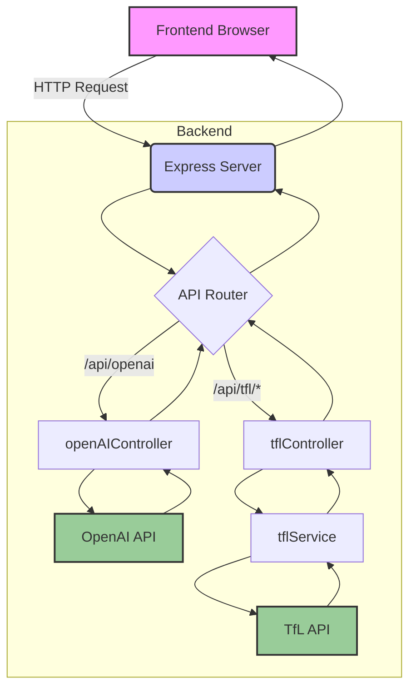

# Application Workflow

Here is a diagram that illustrates the workflow of the application, from the frontend to the backend and external APIs.

**How to read this diagram:**

*   The **Frontend Browser** is where the user interacts with the application.
*   It sends an **HTTP Request** to the **Express Server**.
*   The **API Router** in the backend directs the request to the correct **Controller** based on the URL.
*   The **Controllers** (`openAIController`, `tflController`) handle the logic for each request.
*   For the TfL API, the controller uses a **Service** (`tflService`) to communicate with the external API.
*   The controllers then send requests to the external **OpenAI API** or **TfL API**.
*   The data flows back through the same path to the frontend, where it is displayed to the user.

## Logic and Methods Breakdown

Here’s a breakdown of where the logic for each part of the workflow is located within your project, method by method:

### 1. Frontend (User Interaction)

*   **File:** `verbose_train/frontend/public/index.html`
    *   This file contains the HTML structure, including the text area for the prompt, the buttons, and the containers for the responses.

*   **File:** `verbose_train/frontend/public/app.js`
    *   **`document.addEventListener('DOMContentLoaded', ...)`**: This is the main entry point for the frontend JavaScript. It ensures the code runs only after the entire HTML page has loaded.
    *   **`submitButton.addEventListener('click', ...)`**: This function is triggered when the user clicks the "Get AI Response" button.
    *   **`fetch('/api/openai', ...)`**: Inside the click listener, this is the method that makes the actual network request from the browser to your backend's OpenAI endpoint.

### 2. Backend (Server and Routing)

*   **File:** `verbose_train/server.js`
    *   **`app.listen(PORT, ...)`**: This method starts your Express server and makes it listen for incoming requests on the specified port.
    *   **`app.use('/api', apiRouter)`**: This line of code tells your server to use the router defined in `index.js` for any request that starts with `/api`.

*   **File:** `verbose_train/backend/routes/index.js`
    *   **`router.post('/openai', getOpenAIResponse)`**: This defines the specific route for the OpenAI API. It maps a `POST` request to `/api/openai` to the `getOpenAIResponse` function in your `openAIController`.
    *   **`router.get('/tfl/stoppoints', getStopPoints)`**: This will map a `GET` request to `/api/tfl/stoppoints` to the `getStopPoints` function in your `tflController`.
    *   **`router.get('/tfl/journey', getJourney)`**: This will map a `GET` request to `/api/tfl/journey` to the `getJourney` function in your `tflController`.

### 3. Backend (Controllers and Services)

*   **File:** `verbose_train/backend/controllers/openAIController.js`
    *   **`getOpenAIResponse(req, res)`**: This function contains the core logic for the OpenAI feature. It receives the request (`req`) and response (`res`) objects from Express, calls the OpenAI API, and sends the result back to the frontend.

*   **File:** `verbose_train/backend/controllers/tflController.js`
    *   **`getStopPoints(req, res)`**: This function will handle requests for Stop Points. It will take parameters from the request (e.g., latitude and longitude) and use the `tflService` to fetch the data.
    *   **`getJourney(req, res)`**: This function will handle requests for journey planning. It will take parameters like `from` and `to` and use the `tflService` to get the journey information.

*   **File:** `verbose_train/backend/services/tflService.js`
    *   **`getStopPoints(lat, lon)`**: This function (currently a placeholder) will be responsible for making the actual API call to the TfL `StopPoint` endpoint.
    *   **`getJourney(from, to)`**: This function (also a placeholder) will be responsible for making the API call to the TfL `Journey` endpoint.
